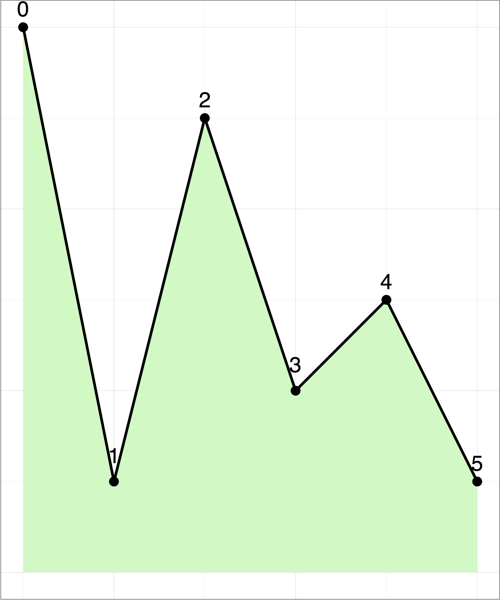

# Mountains

Tahmuras, the third king of ancient Persia, has conquered a huge army of deevs (demons).
He wants to imprison as many of them as possible in Alborz mountains and let the others go.
Alborz is a mountain range with a skyline that looks like a polygonal chain with $n$ vertices.
The $i$-th vertex (for all $0 \le i \le n - 1$) has coordinates $(i, y[i])$, i.e. with longitude $i$ and altitude $y[i]$.

The deevs can be imprisoned on different vertices.
No two imprisoned deevs should be able to see each other; otherwise, they will make eye contact and plan to escape.
Two deevs cannot see each other if there is at least one vertex between them that is strictly higher than a line connecting their vertices.

In the following figure, a deev on vertex $0$ can see deevs on vertices $1$ and $2$.
But it cannot see deevs on vertices $3$, $4$ and $5$, since vertex $2$ is higher than the line connecting vertex $0$ to any of vertices $3$, $4$, or $5$.



Your task is to help Tahmuras find the maximum number of deevs that can be imprisoned in Alborz mountains.

## Implementation details

You should implement the following procedure. It will be called by the grader once for each test case.

```
int maximum_deevs(int[] y)
```

* $y$: integer array of length $n$, the altitude of the vertices
* This procedure should return the maximum number of deevs that can be imprisoned.

## Constraints

* $1 \leq n \leq  2000$,
* $0 \leq y[i] \leq 10^9$ (for all $0 \leq i < n$).

## Subtasks

1. (20 points) $n \leq 19$,
1. (20 points) $n \leq 40$,
1. (30 points) $n \leq 300$,
1. (30 points) No additional constraints.

## Examples

### Example 1

Consider the polygonal chain given in the above figure.

```
maximum_deevs([6, 1, 5, 2, 3, 1])
```

The answer is $3$. One possible solution is to imprison deevs on vertices $1$, $3$ and $5$.

### Example 2

```
maximum_deevs([0, 1, 2])
```

The answer is $1$. The deevs imprisoned on any pair of vertices can see each other (vertex $1$ is on the line connecting vertices $0$ and $2$, not strictly higher).

## Sample grader

The sample grader reads the input in the following format:
* line $1$:  $\;\;n$
* line $2$:  $\;\;y[0] \;\; y[1] \;\; y[2] \;\ldots\;  y[n-1]$

The sample grader prints a single line containing the return value of `maximum_deevs`.
