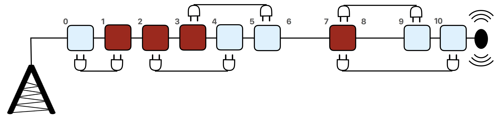

# Wiring

Maryam is an electrical engineer.
She is designing wiring on a communication tower.
On the tower there are some connection points, placed at distinct heights.
A wire can be used to connect any two connection points.
Each connection point can be connected to an arbitrary number of wires.
There are two types of connection points: red and blue.

For the purpose of this problem the tower should be viewed as a line and the connection points
as blue and red points that are at non-negative integer coordinates on this line.
The length of a wire is the distance between the two connection points it connects.

Your goal is to help Maryam find a wiring scheme such that:
1. Each connection point has at least one wire to a connection point of a different color.
1. The total length of the wires is minimized.

## Implementation details

You should implement the following procedure:

```
int64 min_total_length(int[] r, int[] b)
```

* $r$: array of length $n$ containing the positions of the red connection points in increasing order.
* $b$: array of length $m$ containing the positions of the blue connection points in increasing order.
* This procedure should return the minimum total length of wires, among all valid wiring schemes.
* Note that the return type of this procedure is `int64`.

## Example

```
min_total_length([1, 2, 3, 7], [0, 4, 5, 9, 10])
```

The figure below illustrates this example.


* The tower is shown horizontally.
* In the black-and-white printed version of the problem statement the red connection points are dark and the blue ones are light.
* There are $4$ red connection points, located at positions $1, 2, 3,$ and $7$.
* There are $5$ blue connection points, located at positions $0, 4, 5, 9,$ and $10$.
* One optimal solution is shown in the figure above.
* In this solution, the total length of the wires is $1 + 2 + 2 + 2 + 3 = 10$, which is optimal.
So, the procedure should return $10$.
* Note that two wires are connected to the connection point at position $7$.

## Constraints

* $1 \leq n, m \leq 100\,000$,
* $0 \leq r[i] \leq 10^9$ (for all $0 \leq i \leq n-1$),
* $0 \leq b[i] \leq 10^9$ (for all $0 \leq i \leq m-1$),
* Each of the arrays $r$ and $b$ is sorted in ascending order.
* All $n+m$ values in the arrays $r$ and $b$ are distinct.

## Subtasks

1. (7 points) $n, m \leq 200$,
1. (13 points) All red connection points have positions smaller than any blue connection points.
1. (10 points) There is at least one red connection point and one blue connection point among every $7$ consecutive connection points.
1. (25 points) All connection points have different positions in the range $[1, n+m]$.
1. (45 points) No additional constraints.

## Sample grader

The sample grader reads the input in the following format:
* line $1$: $\;\; n \;\; m$
* line $2$: $\;\; r[0] \;\;  r[1] \;  \ldots \; r[n-1]$
* line $3$: $\;\; b[0] \;\;  b[1] \;  \ldots \; b[m-1]$

The sample grader prints a single line containing the return value of `min_total_length`.
